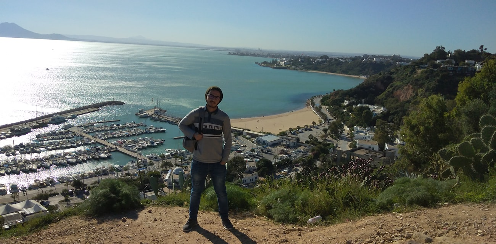

### My name is Aymen
#### I am a full stack application developer

As a problem solver who loves facing challenges in my work, I'm excited to be at the deployment phase of my career as a full stack application developer. I'm passionate and ambitious about my work, and love to be on a team that questions possibilities.  
I've accomplished Web / Mobile / Desktop projects as a freelancer for over two years.

Skills: VUE JS / Spring Boot / Python / Quasar

- 🔭 I’m currently working on Management system for CNIPE ( centre national de l'informatique pour enfant ) 
- 🌱 I’m currently learning Quasar 👌 
- 👯 I’m looking to collaborate on Server side or Back end Projects 

      

 

  

